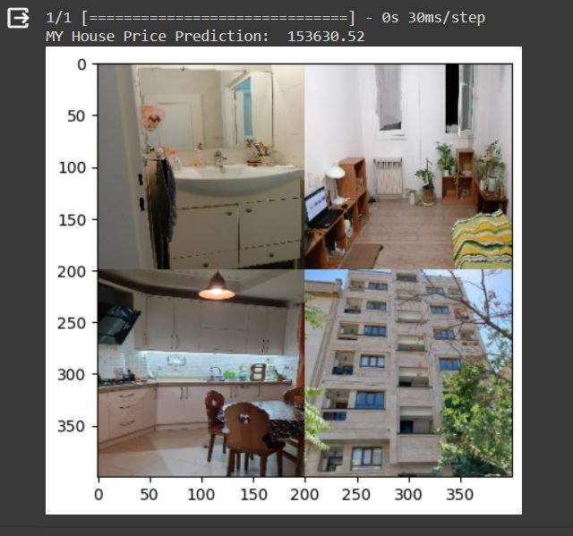

# House Price Prediction 
### Train a CNN for regression prediction with Keras , **WITH INPUT IMAGES**
<br/>

# Description :
+ training a CNN to predict house prices from image data 
+ output of the network is a single continuous value , and its not categorical. 
+ Training the model with a continuous value prediction loss function such as mean squared error, mean absolute error


##  dataset  :
A total of 535 houses are included in the dataset, therefore there are 535 x 4 = 2,140 total images in the dataset. <br/>


+ clone dataset : <br/>
```
$ git clone https://github.com/emanhamed/Houses-dataset
```

This house prices dataset includes four images associated with each house:

+ Bedroom
+ Bathroom
+ Kitchen
+ Frontal view of the house

how are we going to use these images to train our CNN?
> # Important note :
> ## we should create a montage that combines each four images into a single image and then pass the montage through the CNN

<p float="center">
     
</p>

in this order : <br/>
1- The bathroom image in the top-left <br/>
2- The bedroom image in the top-right <br/>
3- The frontal view in the bottom-right <br/>
4- The kitchen in the bottom-left <br/>
<br/>

this method Enables the CNN to learn different filters from all house photos at once and will not “confusing” the CNN with different images but with identical target values.


# How to install
Run this command to install used libraries : 
```
pip install -r requirements.txt 
```
<br/>
<br/>

# How to run 
you can run `House_Price_Prediction_CNN_Regression.ipynb` file and train model : <br/>
or use this save model's weight  , at the end of the code ,  in inference part :<br/>

https://drive.google.com/file/d/1YZMAKxlLj1BR2WbDj259gPUF3tN6Z7op/view?usp=drive_link

<br/>


# Results : 
you can test your own images (montaged) and place them (4 images) in test folder , and then test your model : <br/>

|Train loss| 69.6% |
|------|------|
|Val loss| 69.3% |
| | | 


## our network will be ~69% off in house price predictions. that is a poor result

### My house :
<p float="center">
     
</p>
<br />

### a random house :
<p float="center">
     
</p>
<br />